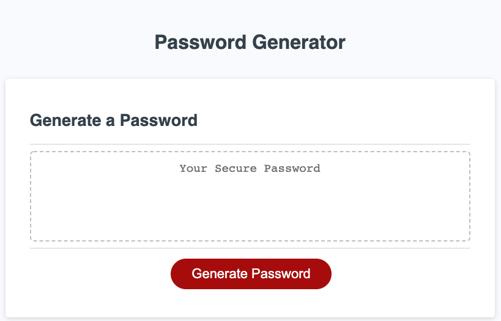
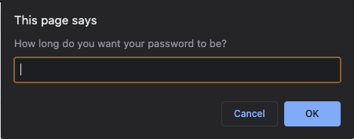
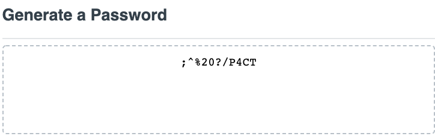

# Password-Generator

## Description
This reposity contains the code used to create and style a online password generator. In order to increase cyber security, the password generator is designed to allow the user to customize their own random password that is both strong and unique. 

## Technologies
Project is created with:
* html
* css
* javascript

## Features
Password generator allows you to choose: 
* how long you want your password to be 
* if lowercase characters are included
* if uppercase characters are included
* if numeric characters are included 
* if special characters are included

## Functionality 
Once the "Generate Password" buttom is pushed, a series of prompts will commence that enable the user to set the criteria in which the password has to meet. The minimum criteria for the code to run includes the password being greater than 8 and less than 128 characters long. One type of character must also be selected to be included. Once all prompts are answered, the code will log the users' preferneces and generate a random password according to the data collected.

Index page

Example of a preference prompt the user must complete

Example of a randomly generated password

[Link to password generator page](https://ma-wong.github.io/Password-Generator/)
